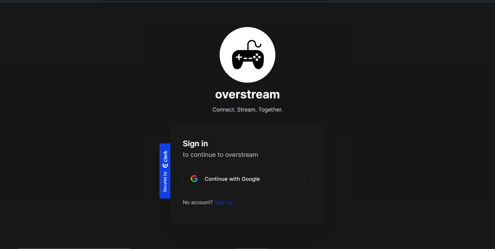

<h1 align="center">
  overstream 🎮
</h1>

> Overstream offers a platform for gamers and other creators to stream and interact with their audience in real-time.

---

## Key Features 📋
- [x] **Stream**
  - [x] **RTMP/WHIP** streaming support
  - [x] **Streamer/creator** dashboard
  - [x] **Real-time chat** with followers/viewers
  - [x] Blocking/removing users from stream
  - [x] **Slow/follower-only** chat modes
  - [x] Collapsible/theatre **layout options**
  - [x] Update stream title/description/thumbnail
 
- [x] **Community**
  - [x] **Follow/Unfollow** users
  - [x] **Search** for users in the community
  - [x] View user streams

---

## Important Links 🔗

- [Frontend](./docs/FRONTEND.md)
- [Database Schema](./docs/SCHEMA.md)

---

## Tools and Technologies 🛠️

**Frontend**
- **Framework**: Next.js 14 (React.js)
- **Language**: Typescript
- **Real-time Chat**: Sockets
- **Authentication**: Clerk 
- **Styling**: Tailwind CSS + Shadcn UI

**Backend**
- **Framework**:  Next.js Route Handlers (Node.js)
- **Language**: Typescript
- **Database**: PostgreSQL
- **ORM**: Prisma

**Infrastructure**
- **Deployment**: Vercel
- **Stream Service**: Livekit 
- **Streaming Protocols**: RTMP / WHIP 
- **Storage** + **File Upload**: UploadThing

---

## Best Practices Followed 📝

- [x] Database indexing for faster queries
- [x] Typescript for type safety
- [x] Conventional & descriptive commit messages
- [x] Linting & Formatting
