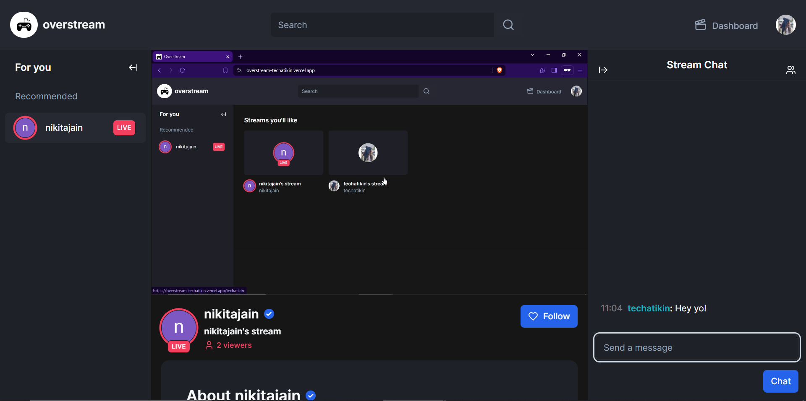
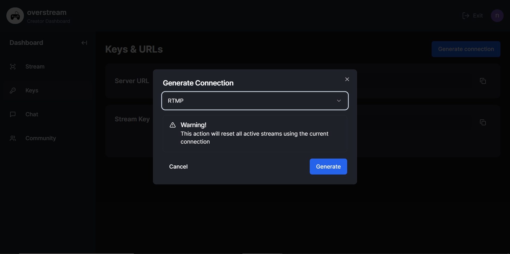

# overstream
> Overstream offers a platform for gamers and other creators to stream and interact with their audience in real-time.

## Streams 🎥

#### Features:

- [x] **View all streams** available on the platform
- [x] View more details about a streamers
- [x] **Search for streams** by stream name/creator name

#### Screenshots:

## Creator Dashboard 🎮

#### Features:

- [x] **Host streams** as a creator
- [x] Chat with **real-time** audience/followers
- [x] Search or block users from chat
- [x] Audience can **follow/unfollow** creators
  
#### Screenshot:

## Manage Streams

#### Features:

- [x] **Update stream details** (thumbnail, description and more)
- [x] Generate **stream key** for OBS integration 
- [x] Manage chat settings (slow mode, follower-only mode)
- [x] **Block/unblock** users in community tab

#### Screenshot:

