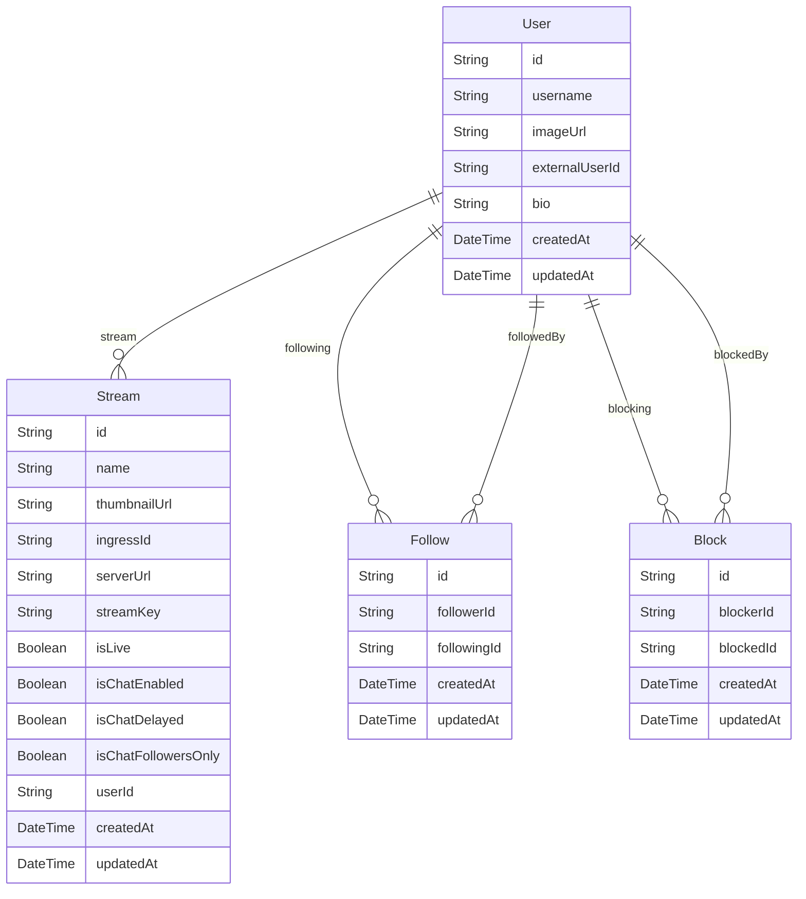

```mermaid
erDiagram
  User {
    String id
    String username
    String imageUrl
    String externalUserId
    String bio
    DateTime createdAt
    DateTime updatedAt
  }
  Stream {
    String id
    String name
    String thumbnailUrl
    String ingressId
    String serverUrl
    String streamKey
    Boolean isLive
    Boolean isChatEnabled
    Boolean isChatDelayed
    Boolean isChatFollowersOnly
    String userId
    DateTime createdAt
    DateTime updatedAt
  }
  Follow {
    String id
    String followerId
    String followingId
    DateTime createdAt
    DateTime updatedAt
  }
  Block {
    String id
    String blockerId
    String blockedId
    DateTime createdAt
    DateTime updatedAt
  }
  User ||--o{ Stream : "stream"
  User ||--o{ Follow : "following"
  User ||--o{ Follow : "followedBy"
  User ||--o{ Block : "blocking"
  User ||--o{ Block : "blockedBy"

```